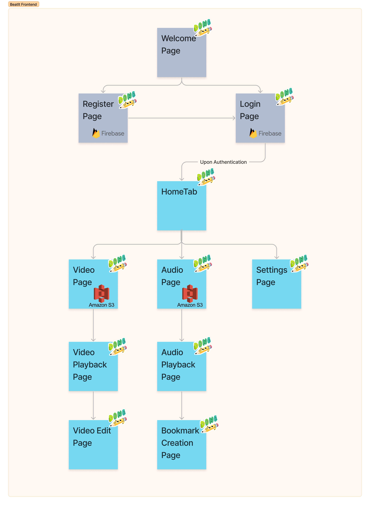

# BeatIt

Orbital Project Repo for Amy and Ivan

## Project Description

### Motivation

Having just picked up dance at the start of university, we faced many challenges when trying to learn choreography. Some examples are when reviewing videos you filmed of yourself, the audio is muffled because the phone’s mic is not that good, causing it to be hard to hear the intricacies in the music that you can hear in real life, or having to scrub back and forth in the music countless times and memorising which timestamp to scrub to.

So something we would like to do is to create an app that makes dance practices more efficient and productive, and to make dancing easier to pick up. We hope to learn more about UI/UX as well as mobile app development through this experience, to make a simple and intuitive interface that reduces friction in user adoption. Once completed, we will be publishing it on the Play Store and continue using it personally.

### Vision

BeatIt will be an app that dancers can use to make their practice sessions more efficient and productive, and make it easier to teach dance to beginners. It will be something that is intuitive for dancers to use and not obstruct or slow down their current practices.

Some features we have planned for it include automatic audio replacement in recorded videos, bookmarking different timestamps in music for quick scrubbing, and annotations that can be placed on videos and shared with others.

These features will allow dancers to spend their time more productively, rather than trying to find the right timestamp to scrub to, or to provide feedback to others quickly.

### User Stories

1. As a practising dancer, I want to be able to review videos of practice sessions without having to download many different apps to process the video and audio recorded.

2. As a practising dancer, I want to be able to slow down the video whenever I am unable to follow the pace of the choreography

3. As a practising dancer, I want to be able to hear the beats of the song in the video clearly at all times.

4. As a choreographer, I want to be able to make annotations to different parts of the video to show the dancers the various positions that I need them to be in more clearly.

5. As a choreographer, I want to be able to share notes that I made with many different dancers.

6. As a choreographer, I want to be able to piece together different audio tracks easily.

7. As a choreographer and a dancer, I want to be able to have a visualisation of the formation changes of the dancers on stage throughout the choreography.

## Proof of Concept

Test account email: ivan@test.sg

Test account password: password

apk file: <a href="https://drive.google.com/file/d/1FjQ-AXrS5Z7biIK0fGWz8jfGVCFYabmB/view?usp=sharing">BeatIt Milestone 2</a>

Video demonstration: <a href="https://drive.google.com/file/d/12h7ISMQxG5oz00L9AhWLLQ8ZN0FYXvMa/view?usp=sharing">Milestone 2 Video</a>

Project Log: <a href="https://docs.google.com/spreadsheets/d/1GDwi6qQS0nuTYDFl_B5mWY0_NZeZzomwl9_lJxQjVLc/edit?usp=sharing">Project Log</a>

Due to cost limitations with cloud services, the backend server to store the media files and bookmarks has been turned off. However at runtime all functionality should still work locally.

Also there is an issue with dark mode, so please remain in light mode when opening the app. If you see white text on a white background, exit the app and force close it in the app switcher, then change to light mode and restart the app.

## Overview of pages

### Authentication Pages - Welcome, Login, Register

Our app allows for the creation of accounts and carries out user authentication via Firebase. On press of the ‘Login’ button, signInWithEmailAndPassword is called, allowing the user credentials to be authenticated. On press of the ‘Register’ button, createUserWithEmailAndPassword is called, allowing for the creation of a new user with the captured user credentials. Upon successful login, the Home page will be displayed.

The backend authentication is done using Firebase. The user can create an account using their email and password, or they can use their Google account to sign up. The user can also login using their email and password, or they can use their Google account to login. The user can also reset their password if they have forgotten it.

The UUID generated by Firebase is used as the primary key for the user in the database, to allow easy identification of relevant rows to the user.

#### Welcome Page

The welcome page is the first page that the user will see when they open the app. It contains a logo and two buttons that will bring the user to the login page or to the registration page.

#### Login Page

The login page contains two text input fields for the user to enter their email and password. It also contains a button that will bring the user to the registration page if they do not have an account. If the user has an account, they can click on the login button to login to their account.

Additionally there is also an option to signup/login with Google, which is a convenient method of creating an account, minimising the friction for using BeatIt.

Login Page of BeatIt which contains two text input fields for the user to enter their email and password, as well as a button to login and a button to sign up for BeatIt.

#### Register Page

The register page contains 4 fields, for username, email, password and confirm password. The user can enter their details into the fields and click on the register button to create an account. If the user already has an account, they can click on the login button to login to their account.

Register Page of BeatIt which contains 4 text input fields for the user to enter their username, email, password and confirm password, as well as a button to register and a button to login to BeatIt.

### Main Pages - Home, Audio, Video, Settings

Our app has the pages Home, Audio, Video and Settings, navigable by a bottom tab. The screen that shows by default is the Home screen.

On the Home screen, we included a search bar, and 2 lists with inbuilt filters for recent videos and videos that the user has favourited.

On the Video screen, we will have a list of all videos imported, as well as a sorting option at the top.

On the Audio screen, we have a list of all user created playlists, as well as a list of all audio files uploaded.

On the Settings screen, the user will be able to adjust settings such as their account details, the colour scheme of the app, or set default values for the various video and audio processing functions.

#### Home Page

The home page is the default page which is shown upon login. On the home page, users will be able to see their favourited videos and audio tracks. This provides them with a quicker way to access the things they want to access more often.

#### Video Page

The video page is where users are able to firstly import the videos that they want to work with and then play them back.

When you click import button, the file explorer for the device will open up and users can navigate to the folder which contains their videos, and once users click use this folder, the videos will be imported.

Within the video player, users can play/pause the video, scrub forward and back through the timeline, and make the video fullscreen.

Once videos have been imported, you will also be able to move pick one to move into the edit page where you can overlay audio.

#### Audio Page

The audio page is where users are able to firstly import the audio tracks that they want to work with and then play them back.

When you click import button, the file explorer for the device will open up and users can navigate to the folder which contains their audio tracks, and once users click use this folder, the audio tracks will be imported.

Along the bottom of this page, there is a mini player similar to Spotify which let's users see which track is playing and toggle play/pause easily. Additionally there is also a favourites button in the shape of a heart which will let users favourite a track as mentioned in the home page.

#### Settings Page

The settings page is where users are able to change the settings of the app. This includes changing the theme of the app, changing the default values for the video and audio processing functions, and changing their account details.

## Features and Implementation

### Audio - Playback

The Audio Playback feature allows users to play audio tracks and control playback, such as pausing, resuming, and seeking. This feature is essential for the app's core functionality, as it enables users to listen to music while practising choreography.

#### Implementation

Audio playback is implemented using the React Native Track Player library. The library provides a set of functions that allow users to control playback, such as play, pause, and seek. The API also provides a set of events that allow users to respond to changes in playback state, such as track change or playback error.

### Audio - Bookmarking

The Bookmarking feature enhances the user experience by allowing them to select and save different timestamps within an audio track, saving them time during practice sessions when they want to replay certain parts of a song or choreography.

#### Implementation

Bookmarks are saved in a database and each bookmark is associated with a specific audio track. The storage system ensures efficient retrieval, management, and synchronisation of bookmarks across devices. These bookmarks are then displayed in a list or grid format, with each bookmark entry including relevant information such as the timestamp and labels. The information will then be sent to the backend to be stored in a database.

Users can interact with the bookmarks section to navigate to specific moments within the audio track or perform management actions. Upon clicking on the bookmark button on the audio playback page, the timestamp stored inside the bookmark is inputted as a parameter to React Native Track Player to seek to. Immediately moving the playback marker to that point.

#### Technical Details

Upon creation of a bookmark, a post request is sent to the Nestjs backend, where it is stored in a Postgresql database on CloudSQL. This allows the bookmarks to be accessible on any device upon login into the same account. We decided to use a Postgresql database so that related objects, such as annotations on the bookmarked sections can be linked together. Bookmarks can be displayed with get requests, edited with patch requests and deleted with delete requests.

### Audio - Import

The Import feature allows users to import audio files from their device's storage. This feature is essential for the app's core functionality, as it enables users to import music for playback and practice. This allows users to use any audio file which they already have on device which they may have downloaded via other means like YouTube or Google Drive or Telegram for example.

#### Implementation

Audio import is implemented using the React Native Scoped Storage library. The library provides a set of functions that allow users to select and import audio files from their device's storage. The API also provides a set of events that allow users to respond to changes in import state, such as file selection or import error.

### Audio - Beat Selection [NOT IMPLEMENTED]

When learning choreography, dancers often learn it at a slower speed first, before building up to the full speed. However at slower speeds, the music can get distorted, which either leads to a distracting background noise or leaves dancers to count the counts themselves. Beat Selection will allow users to select the BPM of a track and allow a simple metronome to be played in place of the music.

#### Implementation

User is prompted to make a selection from a slider to choose a BPM. Based on the selection, the time interval between each beat will be calculated and a sound will be played after every interval.

### Video - Playback [PARTIAL IMPLEMENTATION]

The app utilises video playback libraries, such as the React Native Video Player to ensure smooth and efficient video playback. Users can control playback, pause at specific moments, and seek desired timestamps. A custom UI component displays the video and allows seamless navigation through the annotated timeline.

#### Technical details

We will be using AWS S3 to store uploaded videos. We decided to use a noSQL database as the files uploaded will likely take up alot of space. In addition, we decided to implement a cache system to reduce the number of requests sent to the database, to reduce costs and time needed for streaming the video. On the upload of a chosen video, a cache object will be sent to the local cache directory in the file system, and the video will also be sent to the Nestjs backend via a post request. The backend deposits the video in the bucket with the unique name in the format #video*${userid}*${name}.${fileType} as the key. When a video is chosen to be viewed in the frontend, the cache directory will be first checked for the cache object. If it does not exist, a get request will extract the video as a ReadableStream from the backend and save it into the cache directory.

### Video - Annotations [NOT IMPLEMENTED]

BeatIt is built using React Native for the front end and a combination of Firebase and NestJS for the backend, following a client-server architecture. The Video Annotation feature is a crucial part of the app's functionality, leveraging video processing and storage capabilities to enable choreographers to provide targeted feedback and instructions to dancers.

#### Implementation

The app provides an intuitive annotation editor interface where choreographers can input personalised notes and instructions. The editor supports rich text formatting, allowing the use of different font styles, colours, and sizes. Libraries like Quill can be utilised to implement the annotation editor.

##### Video Processing

The app utilises video processing techniques to extract frames, timestamps, and metadata from uploaded videos. This will be achieved using FFmpeg. Extracted information is stored for reference during annotation creation and playback.

##### Annotation Storage

Annotations are stored in a database and each annotation is associated with a specific video and timestamp. The storage system ensures efficient retrieval, management, and synchronisation of annotations across devices.

##### Video Playback and Navigation

The app utilises video playback libraries, such as the React Native Advanced Video Player to ensure smooth and efficient video playback. Users can control playback, pause at specific moments, and seek desired timestamps. A custom UI component displays the video and allows seamless navigation through the annotated timeline.

##### Annotation Editor

The app provides an intuitive annotation editor interface where choreographers can input personalised notes and instructions. The editor supports rich text formatting, allowing the use of different font styles, colours, and sizes. Libraries like Quill can be utilised to implement the annotation editor.

##### Annotation Sharing

The app incorporates sharing functionalities that enable choreographers to share annotated videos with dancers. This involves integrating APIs or SDKs for popular communication channels, such as email, messaging apps, or social media platforms. Choreographers can share annotated videos via links or export them in common video formats with embedded annotations.

### Video - Audio Overlay [NOT IMPLEMENTED]

BeatIt utilizes advanced audio processing techniques to implement the Automatic Audio Tracking and Replacement feature. By analyzing the waveforms of the original audio file and the recorded video, the app synchronizes and replaces the audio to provide an enhanced practice experience for dancers.

#### Implementation

The app utilises audio processing techniques to extract waveforms, timestamps, and metadata from uploaded audio files and recorded videos. This will be achieved using FFmpeg. Extracted information is stored for reference during audio replacement.

##### Audio Waveform Analysis

The app performs waveform analysis on the original audio file and the recorded video's audio track. This involves converting the audio data into a visual representation, such as a waveform or spectrogram, to capture its unique characteristics.

##### Audio Alignment

The app aligns the waveforms of the original audio file and the recorded video's audio track to identify synchronisation points. Various techniques, such as dynamic time warping or cross-correlation, can be employed to find the optimal alignment.

##### Audio Replacement

Using the aligned waveforms, the app replaces the recorded video's audio track with the original audio file. This involves extracting segments of the original audio file corresponding to specific timestamps and seamlessly blending them into the video's audio track.

##### Audio Mixing and Crossfading

To ensure smooth transitions between the replaced audio segments and the existing video's audio track, the app performs audio mixing and crossfading. This helps maintain a consistent audio experience without abrupt changes or artefacts.

##### Audio Quality and Volume Normalisation

The app ensures that the replaced audio maintains its original quality and volume level. This can involve applying equalisation, noise reduction, or volume normalisation techniques to match the desired audio characteristics.

##### Real-Time Audio Preview

The app provides a real-time audio preview functionality, allowing users to preview the replaced audio before finalising the changes. This enables users to make adjustments or corrections as needed.

## Diagrams

### Frontend

#### User Flow Diagram

<em>User flow diagram of the interactions through the different pages in BeatIt</em>

#### Frontend to Backend Connections

<em>Frontend to Backend Connections for BeatIt</em>

### Backend

#### Architecture Diagram

<em>Simple visualisation of how our system is designed
(However, in our sample app, Cloud Run and Cloud SQL are temporarily disabled to save costs)</em>

#### Brief overview of pages and their features

<em>Pages and features for BeatIt</em>

## Timeline & Development

<table>
  <tr>
    <th>Milestone</th>
    <th>Tasks</th>
    <th>Description</th>
    <th>In-charge</th>
    <th>Date</th>
  </tr>
  <tr>
    <td rowspan=7>1</td>
    <td rowspan=2>Login</td>
    <td>Login, Register UI</td>
    <td>Amy</td>
    <td>19 May</td>
  </tr>
  <tr>
    <td>User Authentication</td>
    <td>Ivan</td>
    <td>20 May</td>
  </tr>
  <tr>
    <td rowspan=2>Audio</td>
    <td>Audio Page</td>
    <td>Amy</td>
    <td>25 May</td>
  </tr>
  <tr>
    <td>Audio Player</td>
    <td>Ivan</td>
    <td>21 May</td>
  </tr>
  <tr>
    <td rowspan=3>UI design</td>
    <td>Sketch of UI design</td>
    <td>Amy</td>
    <td>15 May</td>
  </tr>
  <tr>
    <td>Custom Components</td>
    <td>Amy</td>
    <td>20 May</td>
  </tr>
  <tr>
    <td>Welcome, Home UI</td>
    <td>Amy</td>
    <td>25 May</td>
  </tr>
  <tr>
    <td colspan=5>Milestone 1  
    - Ideation  
    - Proof-of-concept: User authentication  
    - UI for the various pages  
    - Navigation flow</td>
</table>

<table>
  <tr>
    <th>Milestone</th>
    <th>Tasks</th>
    <th>Description</th>
    <th>In-charge</th>
    <th>Date</th>
  </tr>
  <tr>
    <td rowspan="10">2</td>
    <td rowspan = 5>UI design</td>
    <td>Bookmark Creation Page</td>
    <td>Ivan</td>
    <td>12 June</td>
  </tr>
  <tr>
    <td>Audio Playback Page</td>
    <td>Ivan</td>
    <td>7 June</td>
  </tr>
  <tr>
    <td>MiniPlayer</td>
    <td>Ivan</td>
    <td>1 June</td>
  </tr>
  <tr>
    <td>Video Page</td>
    <td>Ivan</td>
    <td>19 June</td>
  </tr>
  <tr>
    <td>BeatIt Logo</td>
    <td>Ivan</td>
    <td>21 June</td>
  </tr>
  <tr>
  <td rowspan=2>Media</td>
    <td>Import Audio</td>
    <td>Ivan</td>
    <td>7 June</td>
  </tr>
  <tr>
    <td>Import Video</td>
    <td>Ivan</td>
    <td>19 June</td>
  </tr>
  <tr>
    <td rowspan=3>Backend</td>
    <td>Set up Nestjs</td>
    <td>Amy</td>
    <td>11 June</td>
  </tr>
  <tr>
    <td>Cloud Run Deployment</td>
    <td>Amy</td>
    <td>18 June</td>
  </tr>
  <tr>
    <td>AWS S3 Database</td>
    <td>Amy</td>
    <td>18 June</td>
  </tr>
  <tr>
    <td colspan="5">Milestone 2:  
    - Completion of basic functions for a working prototype: 
    - All essential pages 
    - Basic video and audio playback functions 
    - Sorting and filtering of list items 
    - Bookmarks 
    - Imports from device’s native file system</td>
  </tr>
</table>

<table>
  <tr>
    <th>Milestone</th>
    <th>Tasks</th>
    <th>Description</th>
    <th>In-charge</th>
    <th>Date</th>
  </tr>
  <tr>
    <td rowspan="7">3</td>
    <td rowspan=2>UI</td>
    <td>Settings Page</td>
    <td>Amy</td>
    <td rowspan=3>27 June - 7 July</td>
  </tr>
  <tr>
    <td>Settings Subpages and logic</td>
    <td>Ivan</td>
  </tr>
  <tr>
    <td rowspan=3>Audio</td>
    <td>BPM selection implementation</td>
    <td>Amy</td>
  </tr>
  <tr>
    <td>Playlist creation logic</td>
    <td>Amy</td>
    <td rowspan=2>8 July - 16 July</td>
  </tr>
  <tr>
    <td>Audio Noise Reduction</td>
    <td>Ivan</td>
  </tr>
  <tr>
    <td rowspan=2>Video</td>
    <td>Implement Annotation</td>
    <td>Amy</td>
    <td rowspan=2>17 July - 24 July</td>
  </tr>
  <tr>
    <td>Annotation Editor UI</td>
    <td>Amy</td>

  </tr>
  <tr>
    <td colspan="5">Milestone 3:  
    - Finish up all screens 
    - Implement all main video and audio processing functions (Audio Overlay)</td>
  </tr>
</table>

<table>
  <tr>
    <th>Milestone</th>
    <th>Tasks</th>
    <th>Description</th>
    <th>In-charge</th>
    <th>Date</th>
  </tr>
  <tr>
    <td rowspan="5">4</td>
    <td rowspan=3>Refinements</td>
    <td>Saving locally and sharing functions</td>
    <td>Amy, Ivan</td>
    <td rowspan=3>25 July - 7 Aug</td>
  </tr>
  <tr>
    <td>More ways to filter and sort</td>
    <td>Amy, Ivan</td>
  </tr>
  <tr>
    <td>Improve accuracy of audio processing</td>
    <td>Amy, Ivan</td>
  </tr>
  <tr>
    <td rowspan=2>Testing</td>
    <td>User Testing</td>
    <td>Amy, Ivan</td>
    <td rowspan=2>8 Aug - 23 Aug</td>
  </tr>
  <tr>
    <td>UI improvements</td>
    <td>Amy, Ivan</td>
  </tr>
  <tr>
    <td colspan="5">Milestone 4: Refinements 
    - Saving locally and sharing functions 
    - More ways to filter and sort 
    - Improve accuracy of audio processing 
    - Testing: User Testing 
    - UI improvements 
    - Splashdown: refinements and testing</td>
  </tr>
</table>
